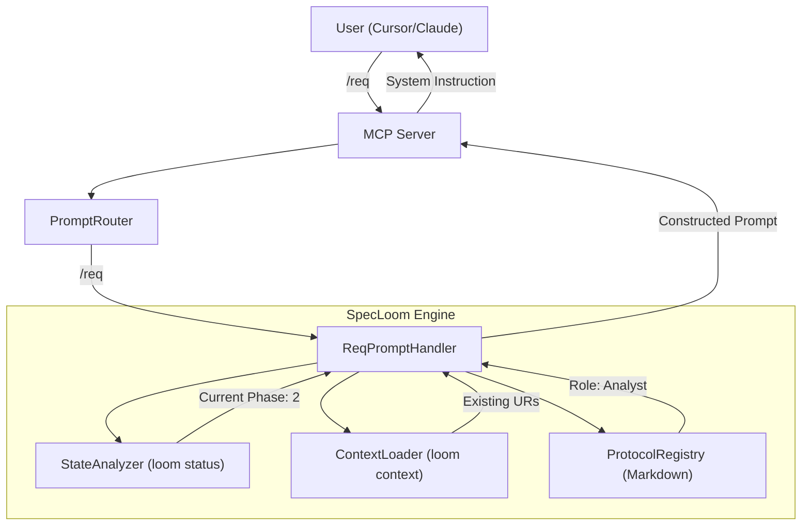

# SpecLoom MCP UX Redesign: The "Intelligent Guide" Workflow

## 1. Problem Statement

### The "Agent-Pull" Friction

Currently, SpecLoom relies on an "Agent-Pull" model where the LLM must proactively discover and read protocols (`read_file .spec/core/protocol/...`) and context (`loom context ...`). This has critical drawbacks:

* **Latency:** Multiple round-trips to load rules before doing work.
* **Token Waste:** Repeatedly reading static instructions.
* **Fragility:** Agents often "forget" or skip reading critical protocols, leading to "vibe coding" (untraceable changes).
* **Cognitive Load:** The user must know the exact CLI command sequence to guide the agent.

## 2. The Solution: "User-Push" via MCP Prompts

We shift to a "User-Push" model using **MCP Prompts** (Slash Commands).
Instead of the agent *asking* for rules, the user *injects* the correct "Persona" and "Protocol" directly into the context window at the start of the turn.

### The "Intelligent Guide" Concept

A Slash Command (e.g., `/req`) is not just a text snippet. It is a dynamic function that:

1. **Analyzes State:** Checks the project phase (Genesis, Spec, Arch, etc.).
2. **Validates Pre-requisites:** Ensures dependencies exist (e.g., "Cannot define `FR` without `UR`").
3. **Constructs Context:** Assembles a targeted System Prompt + relevant Context Data.
4. **Returns Instruction:** "You are now the Requirement Engineer. The user wants X. You must enforce Protocol Y."

---

## 3. The Command Suite (6+4 Strategy)

We define **10 Standard Prompts** that cover the entire V-Model lifecycle.

### A. Core Workflow (The V-Model Guides)

| Command | Phase | Role | Dynamic Logic (State-Aware) |
| :--- | :--- | :--- | :--- |
| **`/load`** | 0 (Bootstrap) | System Bootstrapper | Assesses environment, orients user, proposes next step. |
| **`/init`** | 1 (Context) | Product Manager | Checks if `product_context` exists. If missing, guides user to define Scope. |
| **`/vision`** | 1 (Vision) | Product Owner/Analyst | Shapes initial system vision and defines high-level product goals. |
| **`/req`** | 2-4 (Spec) | Business Analyst | Checks `UCH` coverage. Maps `UR` -> `FR`. Enforces "Problem before Solution." |
| **`/handshake`** | All (Governance) | Governance Facilitator | Facilitates formal agreements to resolve 'Modified' states and lock anchors. |
| **`/arch`** | 5 (Design) | System Architect | Checks `FR` coverage. Enforces "Functions First" rule. Mandates `ADR`. |
| **`/planning`** | 6a (Planning) | Technical Lead | Breaks `FR`/`ADR` into `TASK`s. Checks dependencies. Enforces Traceability. |
| **`/prioritize`** | 6a (Planning) | Product Owner Assistant | Helps manage and prioritize the execution task backlog to deliver value. |
| **`/impl`** | 6b (Execution) | Lead Developer | Reads `loom next`. Ingests Context Bundle. Returns "Coding Agent" instructions. |
| **`/verify`** | 6c (Quality) | QA Engineer | Reviews against `FR`/`ADR`. Generates `SCN`. Handles Defect Tasks. |

### B. Utility Accessors (Direct Retrieval & Execution)

| Command | Purpose | Output Content |
| :--- | :--- | :--- |
| **`/context [ID]`** | Data Fetch | Returns the full JSON content + Up/Down traces for requested IDs. |
| **`/status`** | Health Check | Runs `loom status`. Returns "Phase: X. Open Tasks: Y. Gaps: Z." |
| **`/info`** | System Meta | Returns SpecLoom Manual, Master Protocols, and Agent Instructions. |
| **`/project`** | Project Meta | Summarizes `product_context`, `stakeholders`, and high-level `BR`s. |
| **`/next`** | Task Navigation | Helps the user identify and select the next actionable task. |
| **`/review`** | Code Review | Reviews completed tasks against requirements enforcing Four-Eyes Principle. |

---

## 4. Technical Architecture

### Component Diagram

### Protocol Decomposition (The Role Factory)

The monolithic system prompt has been split into specialized "Micro-Protocols" stored within the **Role Factory** (`.spec/core/roles/<role>/`):

* `.spec/core/roles/analyst/`
* `.spec/core/roles/architect/`
* `.spec/core/roles/planner/`
* `.spec/core/roles/developer/`
* `.spec/core/roles/verifier/`
* `.spec/core/roles/master/`

This structure automatically fuses both the "Protocol" (The Rules) and the "Procedures" (The Actions) into a single, highly constrained context window when the agent assumes a specific role via the `/assign` MCP tool.

---

## 5. Migration Strategy

1. **Refactor Protocols:** Split the master prompt.
2. **Implement Engine Logic:** Create `PromptFactory` and `StateAnalyzer`.
3. **Update MCP Adapter:** Map slash commands to the new factory.
4. **Documentation:** Update `README.md` and `CLI_HELP.md` to feature the new commands as the primary interface.
